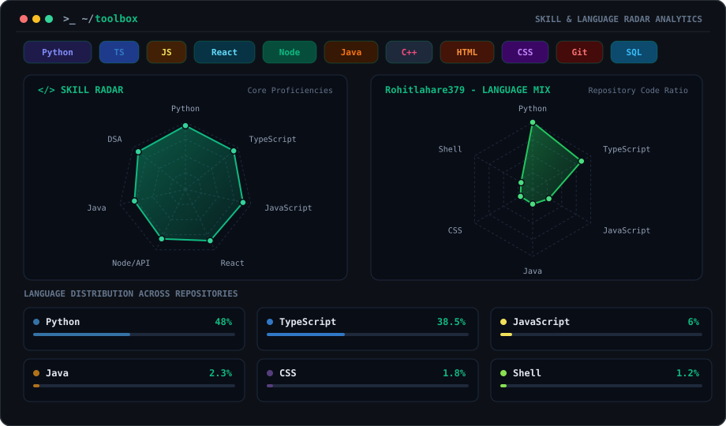
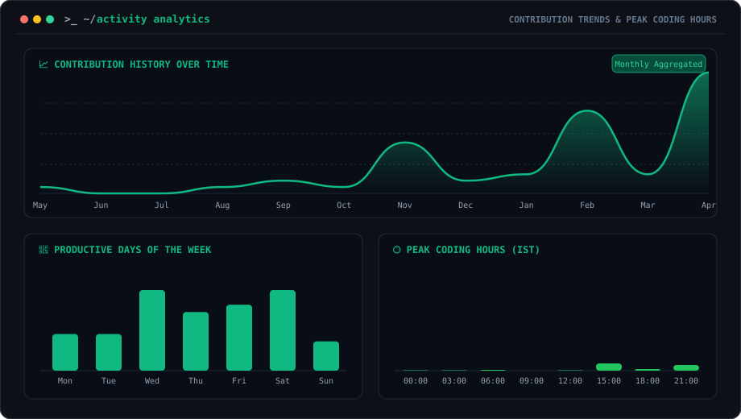
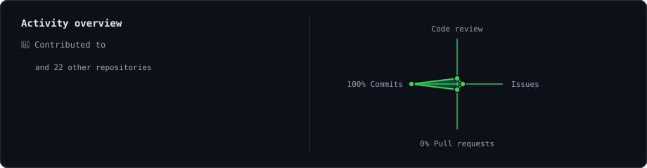

<picture>
  <source media="(prefers-color-scheme: dark)" srcset="generated/animated_ascii.gif" />
  <source media="(prefers-color-scheme: light)" srcset="generated/animated_ascii.gif" />
  
</picture>

## Hi there 👋

Student engineer passionate about algorithms, systems, AI, and building high-performance products that solve real problems.

---

### 🛠️ Toolbox

---

### 📊 Activity Analytics

---

